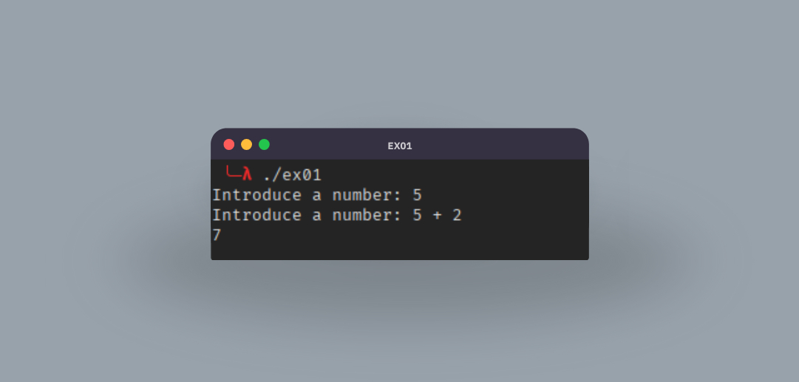

# Día 1

<table align="center">
  <tr>
    <th colspan="3">SUM</th>
  </tr>
  <tr>
    <th>Ejercicio</th>
    <th>Apuntes</th>
    <th>Ejercicio Resuelto</th>
  </tr>
  <tr>
    <td>ex01.cob</td>
    <td><a href="https://www.linkedin.com/posts/david-de-fitero_programaciaejn-cobol-legacysystems-activity-7365131050957598722-EhdA?utm_source=share&utm_medium=member_desktop&rcm=ACoAADQAm3oBnSoq61FTTD_0sNmdoLRTOIbFtB0">Post de LinkedIn</a></td>
    <td><a href="https://github.com/daviddefitero/aprendiendo-cobol/blob/main/dia1/ejercicio-resuelto.cob">ejercicio-resuelto.cob</a></td>
  </tr>
</table>

Pareciera que fue ayer cuando empezaste con COBOL... Vaya, si fue ayer!

Hoy vamos a aprender de verdad cómo funciona la estructura de COBOL y su sintaxis. El objetivo será crear un programa en COBOL que cumpla los siguientes criterios:

- Pedirá dos números enteros al usuario y mostrará su suma final
- El segundo prompt debe incluir el primer número introducido seguido del signo + (número anterior + ...).
- El resultado debe imprimirse alineado, sin espacios sobrantes.

  

Si vas a usar los apuntes del post de LinkedIn, ten cuidado, porque el último párrafo y la foto contienen la solución. No veas esa parte hasta que no hayas completado el ejercicio.