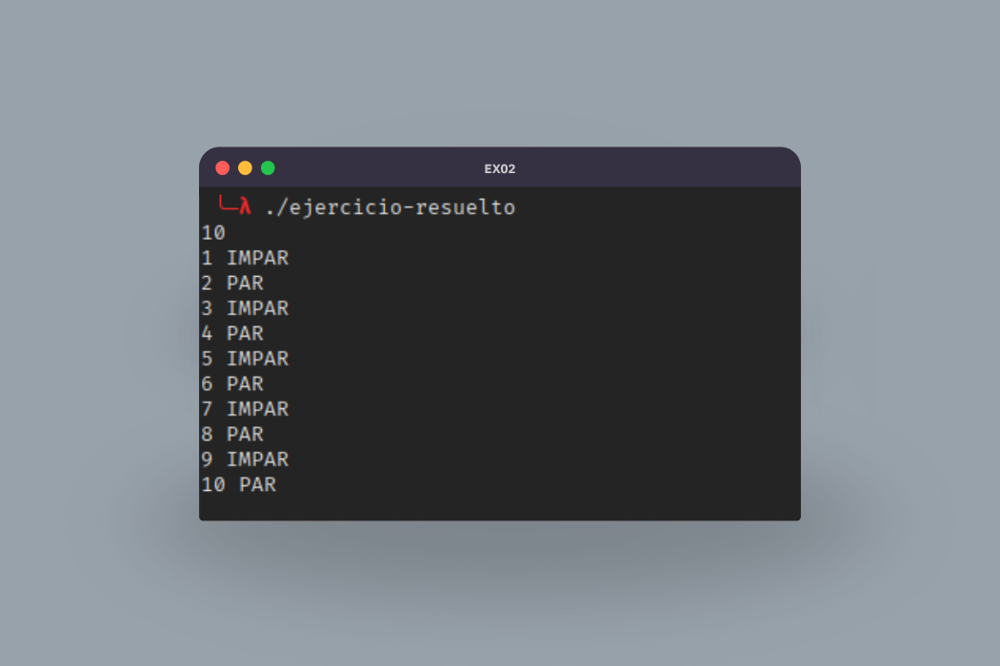

# Día 2

<table align="center">
  <tr>
    <th colspan="3">PAR-IMPAR</th>
  </tr>
  <tr>
    <th>Ejercicio</th>
    <th>Apuntes</th>
    <th>Ejercicio Resuelto</th>
  </tr>
  <tr>
    <td>ex02.cob</td>
    <td><a href="https://www.linkedin.com/posts/david-de-fitero_programaciaejn-cobol-legacysystems-activity-7365390478139183104-rjHt/">Post de LinkedIn</a></td>
    <td><a href="ejercicio-resuelto.cob">ejercicio-resuelto.cob</a></td>
  </tr>
</table>

Identification division... Data division... Workin-sto... Como era? Bueno, te acuerdes o no, has aprendido muchisimo.

A partir de aqui ya va a ser todo una cuesta abajo sin frenos. Ya has pasado por el choque de realidad que te provoca un lenguaje tan diferente a los que estamos acostumbrados a ver.

Hoy es hora de hacer lo que hace 2 siglos hizo por primera vez Ada Lovelace, los bucles! Tambien haras tus primeros condicionales.

Los criterios que debera cumplir el programa son los siguientes:

- Que pida un número entero al usuario.
- Muestre en pantalla todos los números desde 1 hasta ese número.
- Indique para cada número si es PAR o IMPAR.
- El resultado debe imprimirse sin espacios sobrantes.

  

