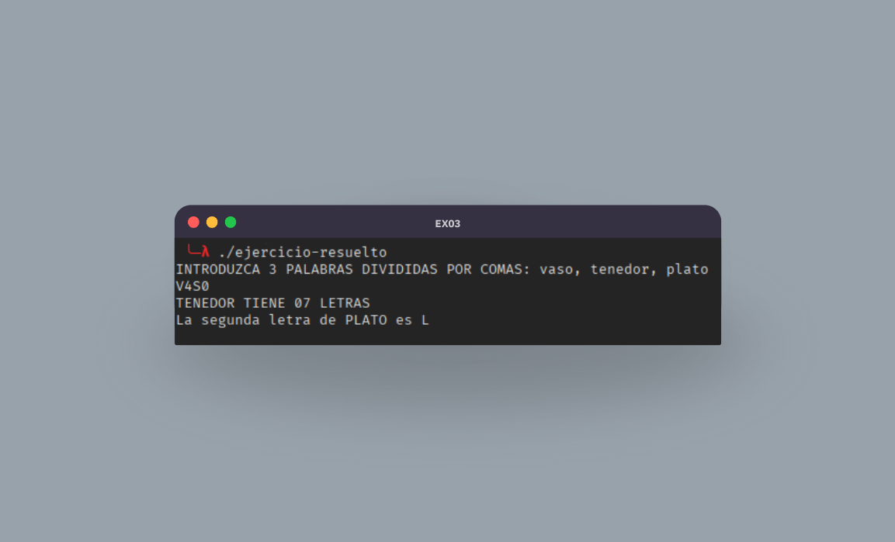

# Día 3

<table align="center">
  <tr>
    <th colspan="3">PALABRAS</th>
  </tr>
  <tr>
    <th>Ejercicio</th>
    <th>Apuntes</th>
    <th>Ejercicio Resuelto</th>
  </tr>
  <tr>
    <td>ex03.cob</td>
    <td><a href="https://www.linkedin.com/posts/david-de-fitero_cobol-activity-7366130934200332288-151h?utm_source=share&utm_medium=member_desktop&rcm=ACoAADQAm3oBnSoq61FTTD_0sNmdoLRTOIbFtB0">Post de LinkedIn</a></td>
    <td><a href="ejercicio-resuelto.cob">ejercicio-resuelto.cob</a></td>
  </tr>
</table>

Puede que te estes atragantando con tanta verbosidad que tiene este lenguaje y estes pensando que esto no es para mi.

Si es asi, recuerda estas palabras:

Grace Hopper también pensó que la programación era demasiado complicada.

En lugar de rendirse, inventó el primer compilador y ayudó a crear **COBOL** para que los humanos pudieran entenderlo.

Si ella pudo transformar esa dificultad en claridad, tú también puedes.

> "No importa lo lento que vayas, siempre y cuando no te detengas." - Confucio

Bueno, suficiente motivacion por hoy... seguro que ya tienes ganas de comerte el mundo... o al menos intentarlo...

Espero que no te hayas cansado de tanta palabreria, porque vas a aprender a hacer que el ordenador hable, o lo que vendria siendo lo mismo, que sea capaz de manejar cadenas texto.

El objetivo consistira en hacer un programa que haga lo siguiente:

- Pida al usuario 3 palabras separadas por comas.
- Divida esas palabras en 3 variables distintas.
- Convierta todas a mayúsculas y elimine los espacios sobrantes.
- A la primera palabra le transforme las vocales en números (A=4, E=3, I=1, O=0, U=5) y la muestre.
- De la segunda palabra muestre su longitud total de caracteres.
- De la tercera palabra muestre su segunda letra.
- El resultado debe imprimirse sin espacios sobrantes.

  

