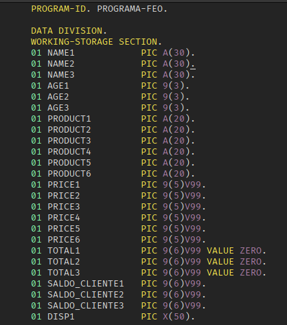
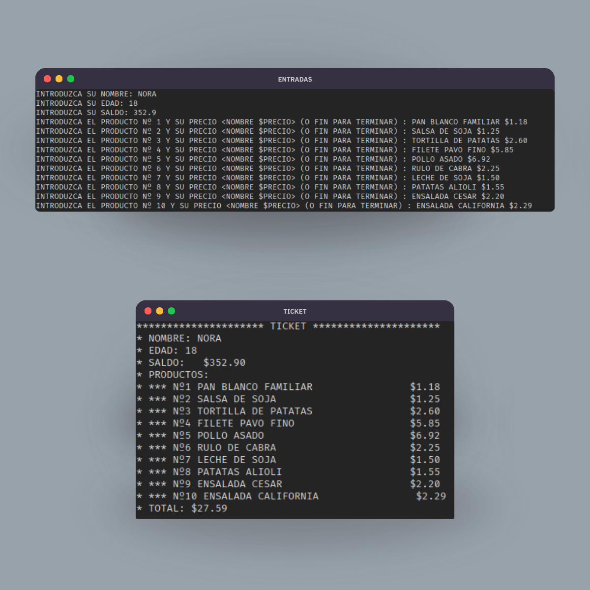

# Día 4

<table align="center">
  <tr>
    <th colspan="3">TICKET</th>
  </tr>
  <tr>
    <th>Ejercicio</th>
    <th>Apuntes</th>
    <th>Ejercicio Resuelto</th>
  </tr>
  <tr>
    <td>ex04.cob</td>
    <td><a href="https://www.linkedin.com/posts/david-de-fitero_cobol-activity-7369721461822910467-D5N5?utm_source=share&utm_medium=member_desktop&rcm=ACoAADQAm3oBnSoq61FTTD_0sNmdoLRTOIbFtB0">Post de LinkedIn</a></td>
    <td><a href="ejercicio-resuelto.cob">ejercicio-resuelto.cob</a></td>
  </tr>
</table>

Seguro que te has fijado en el desorden de variables y datos que se monta cuando haces un programa mínimamente complejo, y si no, pues bueno, fíjate... Imagínate tener que estar trabajando con esto:

  

Como imagino que no querrás tener que enfrentarte a esta aberración durante tu aprendizaje en COBOL, es hora de aprender las estructuras de datos.

Aviso que el día de hoy va a ser muy duro, así que no te sientas mal si se convierte en un día de 48 horas...

El objetivo de hoy consistirá en hacer un programa que cumpla los siguientes requisitos:

- Pide nombre, edad y saldo del cliente.
- Después, solicita productos en el formato <NOMBRE $PRECIO> hasta que se cumpla alguna de estas condiciones:
  - Que el usuario escriba la palabra para finalizar, que será una constante definida por ti, por ejemplo, FIN.
  - Que el usuario llegue a la cantidad máxima de productos, definida también por ti en una constante.
- Guarda los datos en una tabla (array) con un tamaño del número de productos.
- Muestra al final un ticket con:
  - Datos del cliente
  - La lista de productos con su precio formateado
  - El total de la compra.

  

